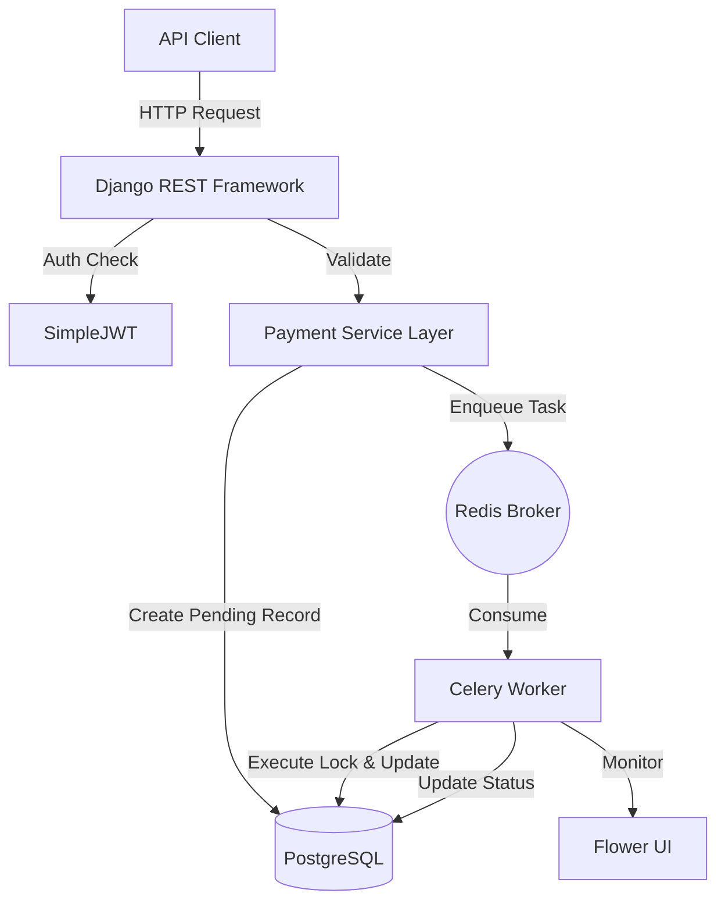
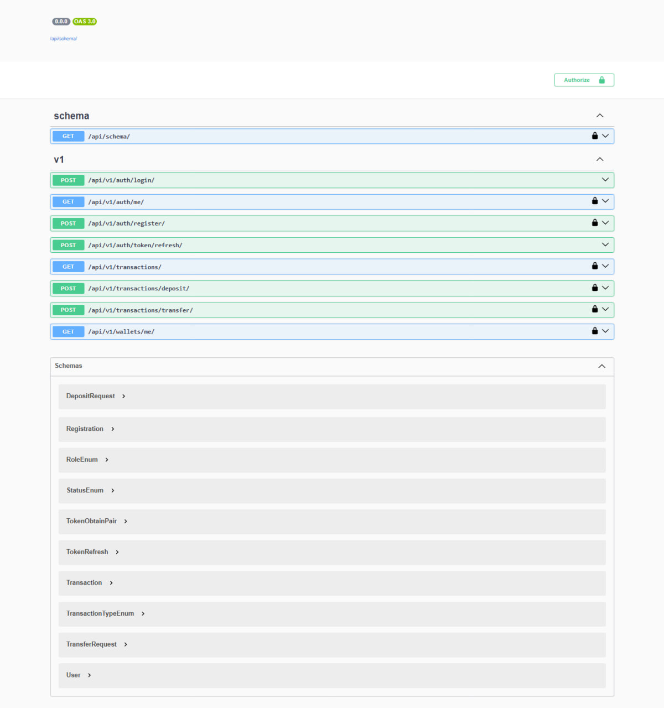
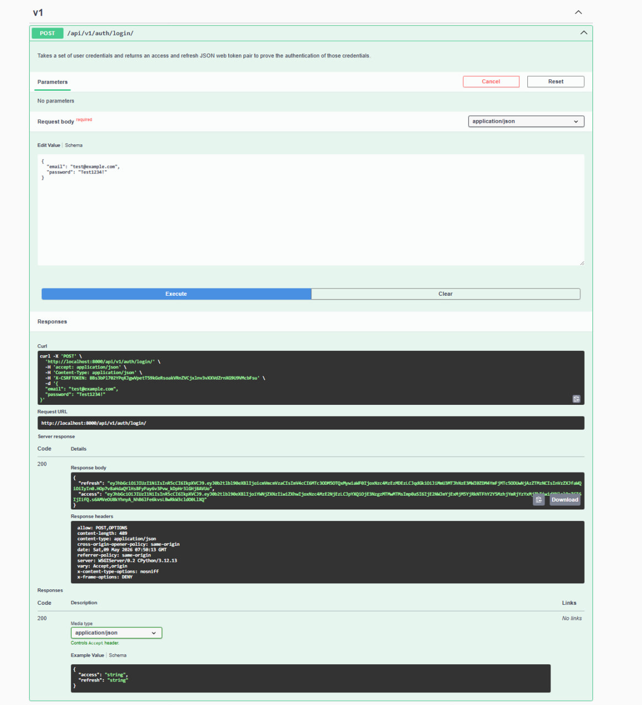
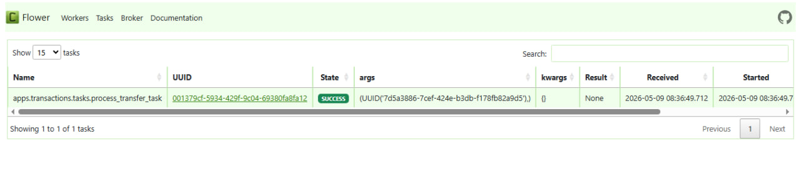
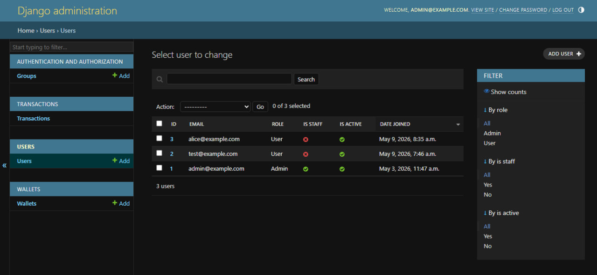
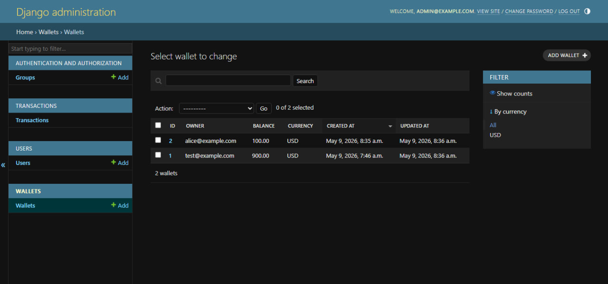
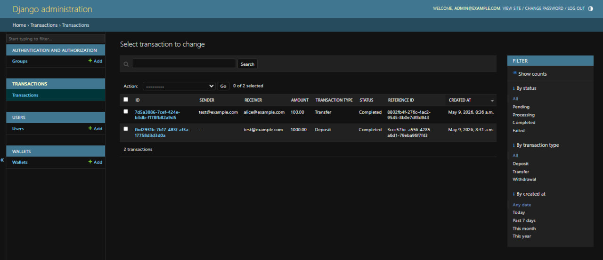

# PayFlowX — Distributed Payment Engine

> PayFlowX is a distributed fintech transaction engine built with Django REST Framework, PostgreSQL, Redis, Celery, Docker, and JWT authentication.
>
> The system simulates asynchronous peer-to-peer payments with idempotent transaction handling, pessimistic locking, retry strategies, audit trails, and real-time task monitoring through Flower.
>
> Designed as a production-style backend architecture, PayFlowX demonstrates distributed systems engineering, async processing, scalable API design, and financial transaction integrity.

---

## 📖 Overview

PayFlowX is engineered to simulate the core financial logic of high-scale payment platforms like Stripe or PayPal. In the world of fintech, "eventual consistency" isn't enough when money is moving. This project solves the critical challenges of building a reliable transaction system: preventing double-spending, handling network timeouts via idempotency, and maintaining a non-blocking API through distributed task queues.

---

## ✨ Key Features

*   **JWT Authentication**: Stateless, scalable identity management.
*   **Wallet System**: Individual account management with strict balance constraints.
*   **Async Transaction Processing**: Offloaded execution via Celery + Redis.
*   **Idempotent Transfers**: Unique request tracking to prevent duplicate billing.
*   **Transaction Audit Trail**: Immutable record of every fund movement.
*   **Dockerized Infrastructure**: Fully orchestrated stack for reproducible deployments.
*   **Swagger API Docs**: Interactive, self-documenting OpenAPI specification.
*   **Flower Monitoring**: Real-time observability of the background worker fleet.
*   **Automated Testing**: 100% coverage of critical financial paths using Pytest.

---

## 🏗️ System Architecture

PayFlowX utilizes a **Layered Architecture** to decouple the API entry points from the heavy financial logic.



### Architectural Highlights:
*   **Django API**: Handles HTTP parsing and initial intent persistence.
*   **Redis Broker**: Decouples the API from the worker, allowing for high-throughput ingestion.
*   **Celery Worker**: The execution core where balance updates occur.
*   **PostgreSQL**: The source of truth, chosen for its ACID compliance and robust row-level locking capabilities.

---

## 🔄 Transaction Lifecycle

1.  **Request Phase**: Client sends a transfer intent with a unique `idempotency_key`.
2.  **Validation Phase**: Initial checks for user identity, receiver existence, and previous request duplicates.
3.  **Persistence Phase**: The transaction is recorded as `PENDING` in the database.
4.  **Dispatch Phase**: A background task is enqueued in Redis. The API returns a `201 Created` immediately.
5.  **Execution Phase**: The worker acquires a **Pessimistic Lock** on the wallet rows and executes the fund movement.
6.  **Finalization Phase**: The ledger is updated to `COMPLETED` and the lock is released.

---

## 🧠 Engineering Decisions: The "Why"

| Decision | Rationale |
| :--- | :--- |
| **Why Celery/Redis?** | Financial transactions can be slow due to external dependencies or DB contention. Offloading this to a queue keeps the user experience snappy. |
| **Why Docker?** | Ensures "it works on my machine" translates to "it works in production." It orchestrates the complex web of DB, Cache, Worker, and API. |
| **Why Service Layer?** | Separates business logic from the web framework. This makes the payment engine testable in isolation. |
| **Why Idempotency?** | In distributed systems, retries are inevitable. Idempotency keys ensure that a user is never charged twice for the same click. |
| **Why Pessimistic Locking?** | To prevent the "Lost Update" problem. We ensure that only one process can modify a wallet's balance at a time. |

---

## 🛠️ Tech Stack

*   **Framework**: Django REST Framework
*   **Database**: PostgreSQL
*   **Caching/Queue**: Redis
*   **Background Tasks**: Celery
*   **Monitoring**: Flower
*   **Infrastructure**: Docker / Docker Compose
*   **Auth**: JWT (SimpleJWT)
*   **Testing**: Pytest-Django
*   **Documentation**: Swagger / OpenAPI (drf-spectacular)

---

## 🖼️ Screenshots

### Swagger Control Center


### Successful API Flow


### Flower Async Processing


### Django Admin — Users


### Django Admin — Wallets


### Django Admin — Transactions


---

## 🏃 Running the Project

1.  **Start the Stack**:
    ```bash
    docker compose up --build
    ```
2.  **Initialize Database**:
    ```bash
    docker compose exec web python manage.py makemigrations
    docker compose exec web python manage.py migrate
    docker compose exec web python manage.py createsuperuser
    ```

---

## 🧪 Testing

```bash
docker compose exec web pytest
```

### Why Testing Matters
In financial systems, a single bug can result in actual monetary loss. We use automated testing to verify **Atomic Rollbacks**, **Idempotency Constraints**, and **Concurrency Safety** before any code touches a production database.

---

## 🔗 API Documentation

*   **Swagger UI**: [http://localhost:8000/api/docs/](http://localhost:8000/api/docs/)
*   **Flower Dashboard**: [http://localhost:5555](http://localhost:5555)
*   **Admin Panel**: [http://localhost:8000/admin/](http://localhost:8000/admin/)

---

## 💎 Portfolio Value

This project demonstrates proficiency in:
*   **Distributed Systems**: Managing state across multiple services (API, Worker, Redis).
*   **Async Architecture**: Handling non-blocking operations in high-throughput environments.
*   **Backend Scalability**: Designing for horizontal growth via stateless JWT and separate workers.
*   **Fintech Integrity**: Implementing industry-standard patterns for financial safety and auditability.
