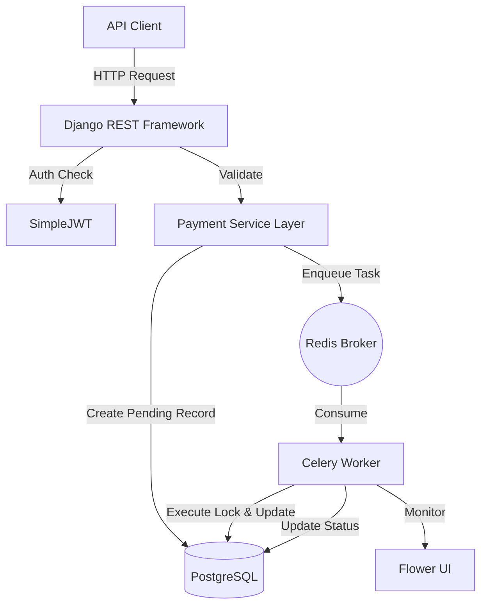

# 🏛️ PayFlowX Architectural Specification

## 1. System Overview
PayFlowX is a distributed payment engine built to handle high-concurrency fund movements. The system prioritizes **consistency** and **durability** (the 'C' and 'D' in ACID) over absolute availability in failure scenarios, ensuring no financial data is ever corrupted.

## 2. Component Diagram (Logical Flow)

## 3. Transaction Lifecycle
1.  **Request Phase**: Client sends a transfer request with an `idempotency_key`.
2.  **Validation Phase**: System checks for valid receiver, positive amount, and existing idempotency records.
3.  **Persistence Phase**: A `Transaction` record is created with status `PENDING`. No money has moved.
4.  **Dispatch Phase**: A task ID is pushed to Redis. The API returns the `PENDING` transaction to the client (Latency: ~50ms).
5.  **Execution Phase**: The worker picks up the task, locks the sender/receiver wallets using `SELECT FOR UPDATE`, and performs the balance swap.
6.  **Finalization Phase**: Status is updated to `COMPLETED`.

## 4. Async Processing & Failure Handling
### Concurrency Strategy
We use **Pessimistic Locking**. When a worker processes a transfer, it locks the specific wallet rows in the DB.
- **Why?** Optimistic locking (versioning) often fails under high contention in financial systems. Pessimistic locking ensures that only one process can touch a balance at any microsecond.

### Failure Handling
- **Insufficient Funds**: Business logic failure. Transaction marked as `FAILED`. No retries.
- **Database Deadlock**: Transient infrastructure failure. Celery retries with **Exponential Backoff** (retry 1s, 2s, 4s, etc.).
- **Worker Crash**: If a worker dies mid-process, the transaction remains in `PROCESSING` status. A cleanup task (scheduled) can identify and re-enqueue these "stale" jobs.

## 5. Idempotency Strategy
The `idempotency_key` is a unique constraint in the PostgreSQL `transactions` table. 
- If a client retries a request that already exists, the database rejects the duplicate insert.
- The `PaymentService` catches this violation and returns the *existing* transaction record instead of creating a new one.
- **Benefit**: Zero risk of duplicate billing due to network timeouts.

## 6. Engineering Trade-offs
| Trade-off | Choice | Rationale |
| :--- | :--- | :--- |
| **Consistency vs Availability** | **Consistency** | In payments, being "offline" is better than "incorrectly double-spending." We use strict DB locks. |
| **Speed vs Integrity** | **Integrity** | We offload execution to Celery. While this adds a sub-second delay to the final balance update, it ensures the API is never blocked by DB row contention. |
| **Architecture** | **Monolithic Core** | For a simulation engine, a well-structured monolith is easier to audit and deploy than a fragmented microservices architecture. |

---
*Document Version: 1.0.0*

